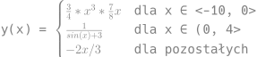

#+header: :exports results :results file raw
#+header: :file svg/pp1zad2.svg
LaTeX dla [[../Podstawy Programowania I/README.org::*Zadanie 2][zadania]]
#+begin_src latex :headers '("\\usepackage{anyfontsize}""\\usepackage{amsmath}" "\\usepackage{xcolor}" "\\usepackage{fontspec}")
\setmainfont{Hack Nerd Font}
\begin{document}
\color{gray}{
{\Large y(x) = 
\begin{cases} 
  \frac{3}{4} * x^{3} * \frac{7}{8} x & \text{dla x ∈ <-10, 0>} \\
  \frac{1}{sin(x) + 3} & \text{dla x ∈ (0, 4>} \\
  -2x/3  & \text{dla pozostałych}}
\end{cases}
}
\end{document}
#+end_src 

#+RESULTS:

